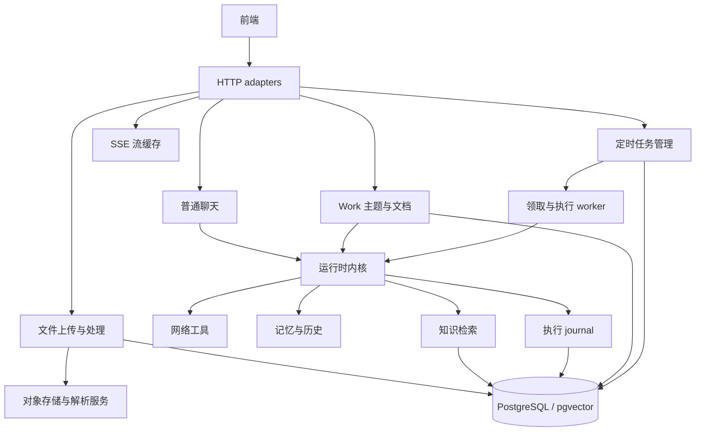

# 工程设计评审：从局部正确到系统保证

评审日期：2026-10-03。评审范围：当前工作区的架构与长期演进，非逐行 code review。

本文基于当前工作区实现，而非仅基于 README、设计目标或 Git HEAD。工作区包含大量近期未提交的架构演进，不能把已提交版本当作当前系统全貌，也不能据此判断这些改动已经部署。本文记录评审结论，不代表下述改进已实施。

后续实施记录（2026-10-03）：第 1 项流归属 P0 已修复并接入正式入口，实际隔离 PostgreSQL 与 Chat / Work HTTP 回归通过，覆盖缓存热冷、刚接受执行、会话删除及实际取消。详见 [P0 修复报告](superpowers/reports/2026-10-03-chat-stream-ownership-fix.md)。第 2 项已采用方案 A 接入 Chat / Work 最终答案的原子 ready、幂等发布、启动扫描与热冷重连恢复，实际数据库故障注入、并发恢复、子进程退出及 P0 回归通过，详见 [发布恢复报告](superpowers/reports/2026-10-03-chat-publication-recovery.md)。未提交最终答案的 running 执行及历史关联回填仍在交付边界外。

后续实施记录（2026-10-04）：第 3 项、本轮 P1 第二项已接入持久 chunk job、owner / epoch / 心跳 / 租约、事务发布校验与启动扫描。普通 pending 可恢复，已领取失效任务显式 interrupted；远程刷新元数据原子提交。实际 PostgreSQL 验证旧执行迟到成功 / 失败、8 路领取、提交故障与提交中过期、资源撤销、子进程退出、正式 HTTP / bootstrap 恢复及相关回归通过，详见 [文档执行所有权报告](superpowers/reports/2026-10-04-document-chunk-ownership.md)。下文保留评审时的证据和判断；其余四项未因此完成，代码未提交或部署。

后续实施记录（2026-10-04）：第 2 项的最终答案之前，新 Chat / Work 现已预留持久执行、领取 owner / epoch 并心跳续租；启动 / 周期扫描和重连将失效执行收敛为 interrupted，保留 Work 已保存内容，阻止迟到结果覆盖终态。实际 PostgreSQL、8 路并发、心跳、事务故障与过期、子进程退出、正式 HTTP 与恢复循环测试通过，相关回归及全仓编译通过。详见 [Chat 执行所有权报告](superpowers/reports/2026-10-04-chat-execution-ownership.md)。历史无关联数据回填、真实模型 / 浏览器及多节点验收仍在边界外；未提交或部署。

核心判断：项目已经形成有价值的业务边界，尤其是定时任务的版本、执行、发布分离，以及 Work 的授权动作、版本和人工确认。接下来几周最值得投入的方向，是把这些局部正确的设计连成可验证的系统保证：资源归属、发布收敛、执行所有权、证据兼容性。此时增加工具、图检索或通用编排抽象，收益低于补齐这些保证。

## 阅读与验证边界

阅读范围覆盖项目说明与进展上下文、运行时规格、Work 和定时任务设计及交付报告、知识处理与图片证据、检索实验、目录与装配、运行时和工具执行、历史与压缩、文档处理和队列、调度领取与发布、Work 状态及文档版本、检索渠道与融合、pgvector、embedding 路由、SSE 缓存与前端事件、记忆与画像、数据库迁移、相关测试和 Git 历史及差异。

重要入口资料：

- [项目进展上下文](project_progress_context.md)
- [对话运行时规格](conversation-agent-runtime-spec.md)
- [定时任务规格](superpowers/specs/2026-09-30-scheduled-agent-tasks-design.md)
- [Work 技术设计](superpowers/specs/2026-10-01-work-topics-technical-design.md)
- [Work 文档协作设计](superpowers/specs/2026-10-01-work-document-collaboration-design.md)
- [Work 交付核对](superpowers/reports/2026-10-02-work-delivery-audit.md)
- [DailyBrief 迁移报告](superpowers/reports/2026-10-03-dailybrief-scheduled-task-migration.md)
- [图片证据交付报告](image_evidence_delivery_report.md)
- [检索预算实验](retrieval_budget_probe_report.md)、[跨文档实验](cross_document_relation_probe_report.md)、[图检索实验](graph_retrieval_probe_report.md)

评审期间执行并通过：

```powershell
go test ./internal/app/runtime/... ./internal/app/rag/core/retrieve/... ./internal/app/scheduledtask/domain/... ./internal/app/scheduledtask/service/... ./internal/app/work/domain/... ./internal/adapter/http/rag/... ./internal/adapter/runtime/... ./internal/framework/stream/... -count=1
go test ./cmd/... ./internal/... -run '^$'
go test ./internal/app/knowledge/service/process ./internal/app/knowledge/schedule/... ./internal/app/rag/core/citation/... ./internal/infra-ai/embedding/... -run 'TestDocumentProcessService|TestCleanDOCX|Test.*Schedule|Test.*Lock|Test.*Citation|Test.*Render|Test.*Concurrency' -count=1
```

第二条仅验证编译；其余为相关测试集合，不能描述为全仓库测试通过。本轮未执行真实模型端到端复验、数据库故障注入或浏览器回归。历史报告中的验证属于历史证据，下文会与本轮静态判断区分。

## 第一阶段：建立项目模型

### 1. 项目解决什么问题

项目已经从文档 RAG 演进为带有持久业务状态的 AI 工作应用，主要有三个入口：

1. **普通聊天**：基于知识库、网络、历史和用户偏好回答，维护消息、摘要与执行记录。
2. **Work 长期主题**：围绕长期议题协作，维护已确认进展、主题状态、协作文档、版本、执行轮次和待确认提案。
3. **定时任务**：在用户确认后执行提醒、摘要或条件检查，管理任务版本、触发 occurrence、尝试 attempt 与结果发布。

知识库是共同基础。DailyBrief 正从旧独立路径向通用定时任务迁移，不能把历史入口和新路径视为完全相同。

因此，项目最重要的正确性已经超出“能检索并回答”：还包括谁授权了动作、操作基于哪个版本、失败后结果能否收敛，以及答案是否得到证据支持。

### 2. 整体架构

整体是模块化 Go 单体。Gin HTTP adapter 经 bootstrap 装配业务服务；聊天和 Work 使用运行时内核，定时任务通过 worker 调用任务执行路径。PostgreSQL 同时承载业务状态、执行记录和 pgvector；文件解析依赖对象存储及 DocReader/OCR/视觉能力；SSE 使用流管理器与可选 Redis 缓存。



当前核心运行时在 `internal/app/runtime`。旧 `internal/app/agent`、旧 RAG tool 和 ingestion 编排的删除，是重要的设计演进；依赖中出现 Eino 不意味着当前主链仍由旧图编排驱动。

Work 复用运行时模型和生命周期，但有自己的工具注册、历史与 scope，不直接继承普通聊天的全局记忆和画像。定时任务的 `RunTask` 同样复用内核，但发布语义由任务域负责。

当前普通运行时不能被描述成已经实现完整的 `awaiting_approval` 状态机。业务草稿确认、Work 已接受动作等约束，是具体业务边界；较早规格中的目标不是现有实现保证。

### 3. 核心执行链路

**知识入库**：上传 → `StartChunk` → 内存 goroutine 队列 → `ExecuteChunk` → 解析 → 父子分块 → 使用知识库指定模型生成 embedding → 可降级增强 → 事务替换 chunk 和向量。子块用于召回，父块提供上下文；预测问题作为额外向量记录。图片处理有修订与持久任务机制，文本处理的恢复保证与其并不完全相同。

**普通聊天**：HTTP 身份与知识库解析 → 持久化用户消息 → `Runtime.Run` → 历史和 journal 投影 → 模型生成与工具校验、执行、结算 → 持久化助手消息 → SSE 完成。流片段可以写入 journal，但不会全部成为模型历史；引用进一步形成消息 sources。

**检索**：`retrieve_knowledge` → 向量、关键词、元数据、Wiki 等渠道 → RRF 融合 → 去重和候选限制 → rerank → TopK → citation handle。TopK、RecallBudget、CandidateLimit 已区分；不能默认旧自动改写或子问题链仍被主入口调用。

**定时任务**：草稿确认 → 不可变任务版本 → 领取到期或待恢复 occurrence → `StartAttempt` → `RunTask` → 三态业务结果 → `FinishAttempt` → `PublishReport` 事务。`ready` 结果允许恢复发布而无需重新调用模型，这是值得保留的边界。

**Work**：`AcceptTurn` 固定授权动作、文档 revision 和进展快照 → `StartTurn` → 有 scope 的运行时 → 读写工具 → 文档修改或提案 → 助手消息 → `FinishTurn`。讨论、编辑和重写的权限不同；文档使用 CAS，进展提案需要人工确认；已成功的业务操作不因后续模型失败而自动回滚。

### 4. 关键状态、转换和不变量

下表区分业务希望维持的性质与已有状态结构。存在状态字段，不代表所有跨模块故障窗口已关闭。

| 对象 | 关键转换 | 最重要的不变量 |
|---|---|---|
| 文档处理 | pending / failed / success / partial → running → success / partial / failed | 迟到的旧执行不能覆盖新执行结果；当前保证存在缺口 |
| 运行时 session | running → completed / degraded / failed / cancelled | 模型执行完成与业务发布完成必须可关联；当前两者尚未形成完整恢复协议 |
| 工具调用 | pending → executing → completed / failed；pending → denied | scope 和授权不能由模型扩大 |
| 定时任务 | active / paused / completed，加删除标记 | 只有已确认版本可执行 |
| occurrence | running / retry → ready → reported，或终止 | 同一次业务结果只发布一次，恢复发布不重复模型执行 |
| Work turn | accepted → running → completed / failed / cancelled / interrupted | 只有当前被接受的动作能执行对应写操作 |
| 文档和主题状态 | revision 单调推进，恢复产生新版本 | CAS 防止静默覆盖，不把恢复当作 revision 回退 |
| 用户、主题、会话、证据 scope | 服务端解析并传入工具 | 模型不能通过自行提供 ID 扩大可访问资源 |

### 5. 重要技术选择及 trade-off

| 选择 | 收益 | 代价或边界 |
|---|---|---|
| 单体与共享 PostgreSQL | 部署简单，业务事务和一致性边界清晰 | 模型调用、journal、业务存储共享资源，需要明确容量和反压 |
| 原生运行时循环替代多层旧编排 | 主链更直接，容易理解工具与生命周期 | 仍强依赖模型行为，旧适配层的容错不能自动算作新链能力 |
| journal 与业务事实分离 | 支持审计、重放和历史投影 | 必须额外定义执行、消息、发布之间的恢复协议 |
| 父子块、预测问题和增强 | 提供多种召回入口、改善上下文 | 成本和有效性需通过固定任务验证，召回更多不等于答案更可靠 |
| Work 使用主题级粗锁和 CAS | 适合当前单人协作，复杂度可控 | 不适合直接扩展成多人实时共编，但当前没有必要提前引入 CRDT |
| 定时任务允许 no_report / uncertain | 避免在证据不足时强行生成结论 | 不能把 no_report 自动解释为已完整检查所有信息 |
| 内存任务队列 | 降低基础设施负担 | admission 不持久，进程退出后的执行所有权和恢复需要补齐 |

### 6. 不确定与证据不足

- **不确定**：线上部署拓扑、用户量、文档量、数据库资源和模型限额，无法把容量假设当作已发生事故。
- **不确定**：当前数据是否含同维度但不同模型的 embedding；代码允许的风险不等于已经出现数据污染。
- **不确定**：近期工作区改动的部署状态；Git 历史只能解释演进，不能证明线上版本。
- **不确定**：生产答案的证据支持率、定时任务漏报率和故障恢复成功率，尚无本轮测量。
- **值得验证**：journal 很可能形成容量瓶颈，但当前没有 profiling 或负载数据证明其优先于模型限额。
- 历史报告记录过 ID 冲突、预览启动事故及检索退化；本轮没有重现，不能将历史报告包装成新实验结果。

## 第二、三阶段：最重要的七个问题

优先级不是要求并行实施七项。先处理授权与恢复；embedding 和 ID 先明确约束，再决定迁移；性能和答案质量用实验选择后续投入。

| 顺序 | 问题 | 判断性质 |
|---|---|---|
| 1 | 流缓存和停止通道绕过资源归属校验 | 确定存在代码路径缺口；未做双用户 HTTP 复现 |
| 2 | 聊天执行完成与业务发布完成缺少恢复协议 | 确定存在协议与提交顺序缺口 |
| 3 | 文档 running 状态代替执行租约 | 内存任务丢失是已知边界；迟到覆盖需故障实验确认 |
| 4 | embedding 维度被当作空间兼容依据 | 确定存在契约不一致；实际数据影响不确定 |
| 5 | 多实例领取能力与 ID 环境约束不匹配 | 历史报告已记录冲突；部署风险取决于拓扑 |
| 6 | 每个流片段同步写数据库，产生反压 | 写放大确定存在；是否是当前瓶颈需测量 |
| 7 | 检索评测尚未形成产品结果发布门槛 | 确定存在证据层级缺口；生产错误率未知 |

### 1. 流缓存和停止通道绕过资源归属校验

#### 问题

普通聊天的续流和停止路径，没有统一地先验证当前用户是否拥有目标执行。缓存命中可以绕过数据库重放路径的归属检查；停止操作直接以 task ID 影响执行和流事件。随机 ID 的难猜性不能替代授权。

#### 证据

- [chat_handler.go](../internal/adapter/http/rag/chat_handler.go)：`ContinueChat` 先按 task ID 调用 `GetEvents`，缓存为空时才进入带用户约束的 runtime replay；`StopChat` 调用 `CancelTask` 并追加 stop 事件，缺少一致的 owner 检查。
- [stream.go](../internal/framework/stream/stream.go)：流接口以 stream ID 寻址，本身没有资源归属语义。
- Work 与普通聊天复用流管理器。Work 自己的入口校验归属，并不自动保护可访问同一流缓存的普通入口；写入 stop 事件也可能被 Work watcher 观察到。

这是静态可确认的校验缺口，不是本轮已验证的越权利用结果。

#### 为什么现在值得关注

多用户场景下，它影响私有输出与执行控制。流 ID 可能通过日志、页面状态或其他业务路径传播。该问题优先于容量优化，因为它违反用户隔离的基础承诺，而且修复范围相对有限。

#### 设计方向

**方案 A：服务端统一解析执行归属，再访问缓存或执行停止。** 用持久的执行记录绑定用户、会话和执行 ID；覆盖 runtime session 尚未创建的 admission 窗口。优点是规则集中、容易测试，并兼容当前 PostgreSQL；复杂度低至中，对现有 HTTP 和执行登记有局部侵入。代价是所有入口必须遵循同一规则，且要定义删除和已结束执行的访问语义。

**方案 B：用户绑定的签名流凭证。** 凭证包含用户、执行 ID、用途和有效期。优点是方便跨连接授权；代价是续期、吊销、删除和停止权限仍需服务端状态支持，增加协议与密钥管理复杂度，对前后端侵入更大。

更倾向 A。项目已有用户与持久业务状态，尚没有充分证据证明需要独立的流 capability 协议。

#### 如何验证判断

使用内存 stream 和 HTTP 测试构造两个用户及一个 Work turn，覆盖缓存热、缓存冷、已删除和刚接受执行的窗口。用户 B 访问 A 的 ID 时，应既读不到内容，也不能追加控制事件或取消执行。成本低，能直接验证跨入口的安全性质。

### 2. 聊天执行完成与业务发布完成缺少恢复协议

#### 问题

运行时完成、助手消息落库、episode 完成和向客户端发送带 message ID / sources 的最终事件，是不同步骤。当前缺少一个可恢复、幂等的发布提交协议。持久 journal 能重放执行事实，不自动保证用户最终看到可关联的业务结果。

#### 证据

- [runtime.go](../internal/app/runtime/runtime.go)：finish 先 `SetStatus`，再记录内容较少的 `EventCompleted`。
- [chat.go](../internal/app/runtime/chat.go)：`Run` 返回后创建助手消息，再 `CompleteEpisodes`，最终带 message ID 和 sources 的完成事件只发给 sink。
- [runtime_stream_sink.go](../internal/adapter/http/rag/runtime_stream_sink.go)：空的 completed 映射为 done，不能补出消息和 sources 的 finish。
- 缓存丢失后，journal replay 无法凭空重建尚未提交或未进入 journal 的发布结果。

因此可以存在 session 已完成但助手消息尚未落库的窗口，也可以存在消息已落库而最终发布步骤失败的窗口。代码顺序能证明窗口存在，本轮没有通过杀进程验证具体用户表现。

#### 为什么现在值得关注

进程重启、消息写入失败或缓存失效，会把“模型完成”与“用户拿到稳定结果”拆开。没有协议时，恢复可能陷入重复生成、缺失结果或永久悬挂。它是普通聊天持久化价值能否成立的关键，比继续增加工具更优先。

#### 设计方向

**方案 A：持久的 answer-ready / pending-publication，加幂等发布。** 保存可发布结果，再以短事务关联唯一助手消息并推进发布状态。恢复仅完成业务投影，不重新执行模型。优点是沿用当前数据库，接近定时任务 ready → reported 的成熟边界；复杂度中等，侵入集中于聊天 finalization 和恢复。代价是增加明确状态和唯一关联，需要处理失败窗口。

**方案 B：事务 outbox 与异步发布消费者。** 业务事务产生持久事件，消费者创建消息和发送通知。优点是可扩展到多种投影；代价是引入后台消费者、延迟、重复消费和运维状态，复杂度中至高，侵入更大。

更倾向 A。先解决一个具体的发布收敛问题，无需为了统一事件架构增加额外基础设施。

#### 如何验证判断

在答案准备完成、助手消息写入前、写入后但最终通知前分别注入失败，清除流缓存再重连。应最终得到一个稳定 message ID 和完整 sources，助手消息恰好一条，模型调用不增加。另验证重启后的 running execution 能变成明确的 interrupted / 可恢复状态，而非永久 running。

### 3. 文档 running 状态代替执行租约，无法充分约束迟到结果

#### 问题

文本处理用业务 running 状态表达执行中，用更新时间识别卡住任务，但缺少贯穿 admission、领取、心跳和提交的执行身份。状态恢复成 failed，不代表旧 goroutine 已停止；新执行开始后，旧执行可能仍能发布。

#### 证据

- [knowledge_document_command_service.go](../internal/app/knowledge/service/document/knowledge_document_command_service.go)：`StartChunk` 在入队前推进 running。
- [task_queue.go](../internal/adapter/taskqueue/goroutine/task_queue.go)：任务由进程内 semaphore 和 goroutine 承载，task ID 不是持久的执行所有权。
- [document_process_runtime_state.go](../internal/app/knowledge/service/process/document_process_runtime_state.go)：`ensureDocumentRunning` 对 running 状态直接通过。
- [document_status_helper.go](../internal/app/knowledge/schedule/document_status_helper.go)：`RecoverStuckRunning` 按 `updated_at` 超时转 failed，没有同时建立新 owner。
- [document_process_persistence.go](../internal/app/knowledge/service/process/document_process_persistence.go)：替换文本 chunk 和向量时锁定文档，但未以 run epoch 判断提交者是否仍是当前执行。

进程内任务重启丢失是已知边界。迟到覆盖的具体交错仍需要实验；锁住文档只能序列化提交，不能证明提交者是正确的一代执行。图片修订机制更强，不应据此推断文本链路拥有相同保证。

#### 为什么现在值得关注

大文件、慢解析或慢模型可能超过 stale 阈值：A 仍在运行，恢复将其标为 failed，用户启动 B，随后 A 迟到提交。结果可能覆盖更晚版本，且表面仍然是 success。若仅增加队列并发，会放大这类交错。

#### 设计方向

**方案 A：保留本地 worker，持久化 job、owner、epoch 和 heartbeat，提交时 fencing。** 业务状态与执行状态分离；只有当前 epoch 能替换 chunk / vector / 状态。优点是不引入新服务，同时支持重启后的领取或明确失败；复杂度中等，对处理入口、恢复和事务提交有集中侵入。代价是租约过期、心跳和终态要有完整语义。

**方案 B：持久消息队列。** 优点是独立扩展 worker、缓冲任务和重试；代价是增加基础设施和至少一次投递语义，且队列并不能替代提交 fencing，复杂度与运维成本更高。

更倾向 A。当前问题是执行所有权，而不是缺少某个队列产品；也没有必要恢复已删除的通用 DAG。

#### 如何验证判断

让 A 在解析或 embedding 后、提交前阻塞；触发 stale 恢复，启动 B 并完成；再释放 A。最终 chunk、vector、状态和处理记录应属于 B。再在接受任务后杀进程，验证持久意图能被恢复或进入明确失败。两个实验比普通成功路径测试更有信息量。

### 4. embedding 维度不等于 embedding 空间兼容

#### 问题

入库明确使用知识库指定的 embedding 模型，查询却可能使用全局默认或 fallback 模型，向量存储主要通过维度过滤。维度相同只能说明数组长度相同，不能说明两组向量可以比较。

#### 证据

- [document_process_pipeline.go](../internal/app/knowledge/service/process/document_process_pipeline.go)：`AttachEmbeddingsWithModel` 使用知识库的 `EmbeddingModel`，预测问题也参与向量化。
- [channels.go](../internal/app/rag/core/retrieve/channels.go)：查询通过 `c.embedding.Embed` 生成向量。
- [vector_store.go](../internal/adapter/vectorstore/pgvector/vector_store.go)：以 `vector_dims` 与查询维度匹配作为检索条件。
- [routing_embedding_service.go](../internal/infra-ai/embedding/routing_embedding_service.go)：默认路由有 fallback 候选，显式 WithModel 路径与之不同。
- [检索预算实验](retrieval_budget_probe_report.md) 记录过维度不匹配导致 hybrid 退化的历史现象。

契约不一致是确定的；当前实际数据是否存在同维度跨模型混用，证据不足。

#### 为什么现在值得关注

不同维度的文档可能被静默排除；同维度跨空间比较则可能返回似乎正常但语义错误的结果。模型切换或故障 fallback 会改变召回质量，排查困难。随着知识量增长，补齐 profile 和重建向量的成本会明显上升。

#### 设计方向

**方案 A：先约束为一个明确的 embedding profile。** 对不兼容知识库拒绝向量检索或显式降级到词法检索，禁止跨空间 fallback。优点是改动较小，行为可解释；复杂度低，对查询路由和校验局部侵入。缺点是限制多模型知识库和迁移灵活性。

**方案 B：持久不可变 profile，按 profile 分组查询。** profile 包含 provider、model、维度和预处理版本；各组使用对应模型查询，再融合排名。优点是支持迁移和异构知识库；缺点是模型调用和延迟增加，复杂度中至高，需要修改数据契约及检索装配。

短期倾向 A，同时确定可演进的 profile 字段；确有多模型需求后再推进 B。跨空间原始距离不应直接当作统一分数比较。

#### 如何验证判断

用三组各十条已知事实建立小知识库：模型 A、同维度模型 B、不同维度模型 C。分别改变默认模型、显式选择和故障 fallback，记录实际 profile、召回率与降级原因。无需大规模 benchmark 即可验证契约是否一致。

### 5. 多实例领取已支持，但 ID 的环境唯一性未受控

#### 问题

任务领取和并发执行在向多实例能力演进，而当前 ID 生成依赖环境提供唯一 machine identity，这一约束没有在系统启动层形成明确保证。

#### 证据

- [sonyflake.go](../internal/framework/distributedid/sonyflake.go)：默认 settings 设置 StartTime，没有显式的 MachineID 分配或 CheckMachineID 管理。
- [Work 交付核对](superpowers/reports/2026-10-02-work-delivery-audit.md)：记录同主机测试进程出现主键冲突，验证因此使用 `-p 1`。这是历史报告，本轮未再次重现。
- 数字 ID 不仅用于主键，也参与 `AfterID`、`ThroughID`、`CoveredTo` 等消息分页与摘要边界。替换时必须审计顺序语义。

#### 为什么现在值得关注

同主机并行服务、滚动重启重叠、CLI 和服务并行运行，可能暴露 ID 冲突；调度租约正确并不能抵消主键冲突。若近期要上多进程部署，应把此项提升到恢复改造之前。若始终单进程，则可先明确启动约束，但不能把 `-p 1` 当作根治。

#### 设计方向

**方案 A：显式分配 machine ID，并在启动时检测冲突。** 保留既有数字格式和顺序特性，代码侵入低；需要租约或运维分配，环境生命周期和重叠启动增加复杂度。

**方案 B：使用 PostgreSQL sequence 统一分配数字 ID。** 优点是与当前共享数据库部署相符，减少环境假设，兼容数字字段；缺点是增加数据库调用，对分页和摘要边界仍需验证，迁移复杂度中等，适用范围依赖共享数据库。

更倾向先小范围验证 B。当前系统本就依赖 PostgreSQL，尚无充分证据要求脱离数据库生成 ID。不要直接改成随机 UUID 而忽略既有顺序语义。

#### 如何验证判断

启动两个独立进程，同步高频生成 ID，检查重复；随后并发写入消息并重启，验证分页与摘要覆盖边界不遗漏、不重复。生成唯一性和业务读取语义都通过，才算完成。

### 6. 每个流片段同步写数据库，可能形成系统性反压

#### 问题

thinking/content delta 同步记录到 journal，每次写入有事务、session sequence 更新和事件插入；工具执行前后又读取 journal。流碎片数量可以改变数据库成本，即使答案字节数完全一样。

#### 证据

- [runtime.go](../internal/app/runtime/runtime.go)：模型流回调调用同步 `recordAndEmit`。
- [runtime store](../internal/adapter/repository/postgres/runtime/store.go)：`Append` 及 `appendJournalTx` 涉及事务、sequence 更新和事件插入。
- 运行时在执行过程多次 `ListJournal`，其中流片段并不都进入历史投影。
- 检索实验提供质量探针，但本轮搜索未发现覆盖这条运行时容量链的 Go benchmark。

写放大与同步反压确定存在；是否已成为当前最大瓶颈，证据不足。

#### 为什么现在值得关注

数据库 RTT 增加、模型流更碎、并发聊天增多时，生成速度可能由模型回调中的数据库提交决定。journal 与业务数据共享数据库，还会影响 Work、调度和知识库操作。它值得实验，但不值得在测量前进行大规模优化。

#### 设计方向

**方案 A：按时间或字节聚合 delta，批量持久化后发送；历史投影增量读取。** 保留可重放语义，减少事务和读取量；复杂度中等，主要侵入 journal 与 sink。代价是少量延迟，要定义批次内失败和 cursor 边界。

**方案 B：只持久完整结果和工具事实，流碎片进入临时缓存。** 大幅降低写入；但改变缓存失效后的重放能力，需要重新定义 cursor 和恢复承诺，侵入更大，不只是性能优化。

倾向先测量，再选 A。若产品明确接受片段不可恢复，B 才具有充分收益依据。

#### 如何验证判断

使用假模型输出相同总字节数，拆成 100、1,000、5,000 个 delta；并发 1、10、50，改变数据库 RTT。测量事务数、WAL、回调阻塞时间和端到端 P95。无需真实模型费用，就能隔离碎片写入的成本及对业务请求的影响。

### 7. 检索评测有价值，但尚未形成产品结果的发布质量门槛

#### 问题

现有实验与运行时评估器是有价值的基础，但“召回正确 chunk”“引用 ID 合法”“工具运行成功”，都不能直接证明最终结论得到证据支持，或定时检查没有漏掉应该报告的情况。

#### 证据

- [检索预算实验](retrieval_budget_probe_report.md)：讨论合法 chunk ID 与主张支持之间的差距；固定检索探针不能直接外推完整产品入口的效果。
- [t2ranking-agent-eval](../cmd/t2ranking-agent-eval/main.go)：已有 runtime 评估，不应描述为缺少端到端评估；其中 `answerUsesExpectedEvidence` 主要匹配 ID 字符串，并不验证 entailment。
- [DailyBrief 迁移报告](superpowers/reports/2026-10-03-dailybrief-scheduled-task-migration.md)：实际数据库验证与注入运行时的证据，不能替代尚待验证的真实模型和浏览器链路。
- 定时任务允许工具失败和 no_report；没有错误报告不自动证明信息检查完整。

这里确定的是验证层级缺口，生产错误率仍未知。

#### 为什么现在值得关注

若继续依据命中率增加图检索、预算或工具，可能提高成本却没有改善产品结果。漏报、过期证据、合法但不支持主张的引用，会侵蚀用户信任。应先建立可以改变投资方向的小型产品质量门槛。

#### 设计方向

**方案 A：小型人工标注的真实入口结果集。** 固定数据、模型和入口，标注必要概念、证据组、关键主张和无证据时的合理行为。优点是成本可控、判断可解释，可复用现有评估器；侵入低。缺点是覆盖有限，需要维护样本与人工校准。

**方案 B：大规模自动 judge。** 优点是覆盖广、适合持续趋势；缺点是费用、偏差、校准和对输入操纵的敏感性，复杂度较高，不能代替少量人工基准。

倾向 A，后续用人工基准校准 B，而不是新建一套通用评测框架。

#### 如何验证判断

先做约三十个场景：多证据、冲突证据、过期信息、信息缺失，以及有官方发布时间约束的定时检查。通过真实入口测量关键主张支持率、必要信息覆盖、漏报、误报、重复发布和成本；对 no_report 抽查实际 journal，确认是检查后无结果，还是工具失败后退出。

## 第四阶段：如果这是我的项目

### 1. 接下来最先做的三件事

1. 关闭跨入口流读取和取消的归属缺口，并留下双用户回归证据。
2. 把聊天发布收敛与文档执行所有权做成可注入故障的协议：分别验证重启、缓存丢失、重复提交和迟到执行。
3. 明确 embedding profile 约束，并建立小型真实入口产品质量基准，以此决定检索和模型投入。

如果近期部署多进程，ID 唯一性验证和修正提前到第二项之前。

### 2. 明确不会现在做的事情

- 不拆微服务，也不恢复通用 workflow、旧 agent 或 ingestion DAG。
- 不因为图模式流行就引入 LightRAG、Neo4j 或扩大所有检索预算。
- 不提前实现多人实时共编与 CRDT；当前 Work 的单人轮次、主题锁和 CAS 足够合理。
- 不为了统一形式增加通用 repository 或事件抽象。
- 不让大规模前端风格整理和类型清理挤占系统正确性投入；已知类型基线可以独立推进，但不是本次架构优先级。

### 3. 最值得重新审视的架构决策

重新审视“持久 journal 等于可恢复执行”的隐含假设。journal 解决事实记录和重放；结果发布、运行中断、重试所有权与提交 fencing 是另外的协议。需要逐业务定义，不应通过一个 running/completed 字段或万能运行时替代。

### 4. 应该继续坚持的设计

共享运行时内核，同时让业务域拥有授权、版本和发布规则，是正确方向。具体应保留：

- 定时任务 version / occurrence / attempt 的分离，以及 ready 后恢复发布。
- Work 的接受动作、人工确认、CAS 和恢复生成新版本。
- 服务端确定 scope，模型不能扩大资源范围。
- 已成功业务操作不因后续模型失败而被假装回滚。
- 当前单人 Work 的粗粒度主题锁，先保证清晰语义。

这些机制有明确业务收益，无需为了“更通用”削弱边界。

### 5. 最可能成为瓶颈的地方

短期最可能是共享模型容量与同步 journal 数据库写入，而不是缺少分布式服务。当前原生运行时的直接模型调用，不能被视为自动继承旧路由层的所有 fallback 和限流保证。

向量规模增长后，再用真实 workload、查询计划和 profile 数据决定索引及数据库调整。没有数据前，不能认定向量数据库就是第一瓶颈。

### 6. 只有一周开发时间时

| 时间 | 投入 | 必须留下的验收证据 |
|---|---|---|
| 第一天 | 流读取与停止的统一归属校验 | 双用户、跨 Work/Chat、缓存热冷场景均无法越权 |
| 第二至三天 | 聊天发布状态及幂等恢复 | 三个提交窗口失败后，稳定结果、单条消息、不重跑模型 |
| 第四至五天 | 文档执行 epoch 与提交 fencing | A 迟到不能覆盖 B；接受后重启具有明确去向 |

这一周不承诺解决全部七项。每项都交付可重复的性质验证，下一周再落实 embedding / ID 的约束及容量、质量实验。若多进程上线迫近，调整优先级先处理 ID。

### 7. 达到高质量工程项目最缺什么

最缺的不是更多模式、更多日志或更高测试数量，而是几条可以重复证明的发布承诺：

1. 未授权用户不能读取或取消别人的执行。
2. 已接受的操作在失败与重启后能收敛到明确结果。
3. 旧执行、旧版本和重复请求不会污染新结果。
4. 查询向量与文档向量属于兼容 profile。
5. 关键结论得到证据支持，no_report 不掩盖未完成检查。
6. 缓存丢失与重启后，上述承诺仍成立。

项目已有足够好的业务设计基础。接下来应通过少量高信息量实验，把局部实现变成这些可依赖的系统保证，而不是继续扩大架构表面积。
